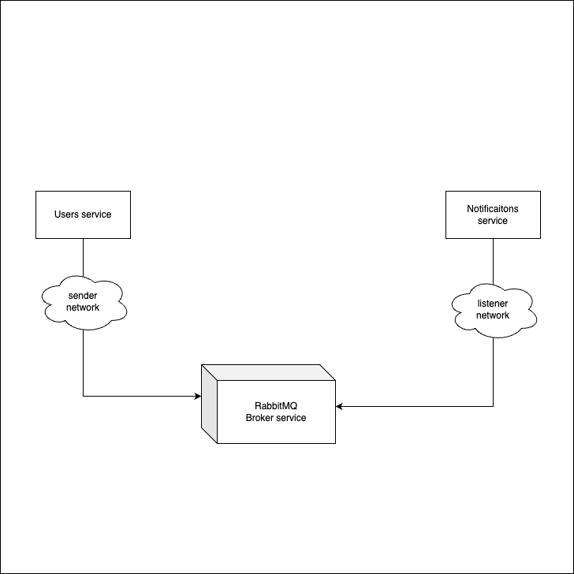

# NextBasket Microservice



## Tools
1. PHP 8.1+
2. [Lumen](https://lumen.laravel.com) Framework
3. [RabbitMQ](https://www.rabbitmq.com/)
4. [Composer](https://getcomposer.org/)
5. Docker

## File structure
```
.
└── nextbasket/
    ├── lib
    ├── services/
    │   ├── users
    │   └── notifications
    └── docker-compose.yml    
```

1. The lib folder contains the shared libraries by all services.
2. The services/users packages the user microservice (built with Lumen)
3. The services/notifications notification worker
4. The `docker-compose.yml` file to boostrap the all services.

 The users service image is named **`wolvecode/nextbasket-users`**, and the notifications service image is **`wolvecode/nextbasket-notifications`**. You can pull both image running
```shell
docker pull wolvecode/nextbasket-users && docker pull wolvecode/nextbasket-notifications
```

## Getting Started
The rest of this guide assume that you have Docker running. Each of the microservices has its own image
on the Docker Hub. The easiest way (and the preferred way) is to use `docker-compose` to start the services as described
in [docker-compose.yml](./docker-compose.yml) file. Run the next command from the root folder:
```shell
docker-compose up
```

After the services are all up and running, you can use your [Postman](https://postman.com) or any client request tool
to make request to the `users` service endpoint, OR you simply use `curl` as
```shell
curl http://127.0.0.1:9000/users -X POST -H "Content-Type: application/json" -d '{"email": "wolvcode@gmail.com", "firstName": "Biodun", "lastName": "Azeez"}'
```

## Inspecting Logs
Following a simplistic approach, all payloads are written to a log file for each of the services, and you can inspect the logs contents from each container instance as:
- Users service
```shell
docker exec -it users tail -f /app/nextbasket/services/users/storage/logs/app.log
```
- Notifications service
```shell
docker exec -it notifications tail -f /app/nextbasket/services/notifications/src/app.log
```

